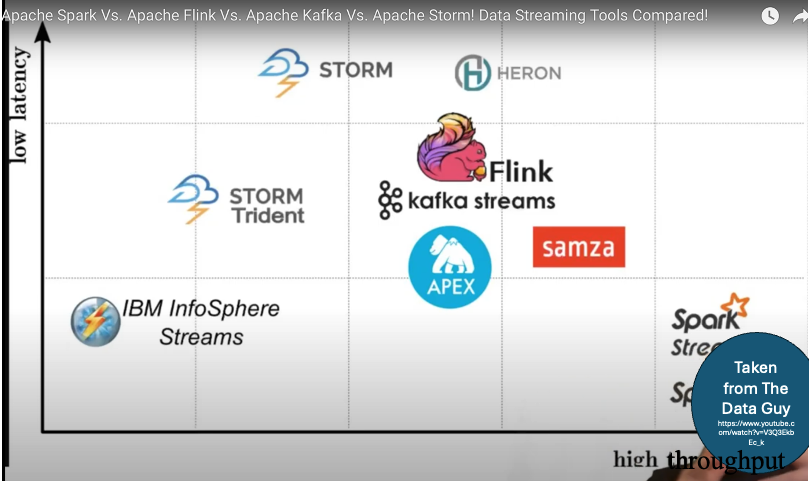

# Building ETL and Data Pipelines with Bash, Airflow and Kafka


A project to learn about ETL data pipelines with Apache Airflow and streaming pipelines with Apache Kafka.

Link to free IBM course on edx:  
https://learning.edx.org/course/course-v1:IBM+DB0250EN+3T2021


## Module 1: Data Processing Techniques
### ETL:
> - extract (from multiple sources)
> - transform data to uniform data format/ structur (data wrangling)
> - load data into new environment

- transformation: 
    - conforming to target systems and use cases
    - cleaning, filtering
    - joining
    - feature engineering
    - formatting and data typing
- use cases:
    - analogue to digital transformation
    - moving data from OLTP to OLAP systems
    - dashboards
    - training & deploying ML models
    - complex transformations
        - -> curating data & making it accessible
        - -> for structured, relational data; scalability difficult (often local cumputing resources)
- streaming use cases: weather station data, social network feeds, IoT devices, fraud detection, real-time product pricing 

### -> trend goes to:
### ELT
- extract and load first, transformation afterwards (on demand) -> pipeline separated from transformation
- data loaded to sophisticated analytics platform such as data lake
- dynamic approach
- use cases:
    - demanding scalability requirements of Big Data
    - streaming analytics
    - highly distributed data sources

- processing data usually faster than moving it -> flexibility
- no information loss (transformation on demand)
- structured & unstructured data in cloud

### Differences ETL <-> ELT
- place of transformation
- flexibility
- big data support
- time-to-insight

-> currently increasing demand for raw data-> ad hoc, self-serve analytics

### Data Transformation Techniques:
- schema-on-write (ETL) -> consistency
- schema-on-read (ELT) -> versatility
- typing, structuring, normalizing, aggregating, cleaning

### Data Loading Techniques:
- **full loading**: batch of all data e.g. for porting transaction history
- **incremental loading**: append data, accumulate transaction history (batch or stream)
- **scheduled/ on-demand**: e.g. cron jobs
- **batch loading**: chunks, periodic updates
- **micro batch**: short time windows to access older data
- **pull technology**: email, ree
- **push technology**: push notifications, instant messages (subscribers)
- **parallel loading**: big data in chunks (boost) 


## Module 2: ETL & Data Pipelines: Tools and Techniques

### Helpful Shell commands:
```bash
cut [OPTION] [FILE]
```

| OPTION |   Description | Example |
| -------| --------------| ---|
| -c (--characters=LIST)| select only some characters, using a specified character, a character set, or a character range | cut -c2-4 |
| -d (--delimiter) | specify delimiter, default is TAB | cut -d":" -f1 /etc/passwd |
|-f (--fields=LIST) | select only specified fields | cut -d":" -f3-6 /etc/passwd

```bash
tr [OPTION] SET1 [SET2]
```

| OPTION |   Description | Example |
| -------| --------------| ---|
| -s | replace a sequence of repeated characters with a single occurrence | tr -s " " |
| -d  | delete specified characters | echo "My login pin is 5634" \| tr -d "[:digit:]" |

Translate all lower case alphabets to upper case:
- echo "Shell Scripting" | tr "[a-z]" "[A-Z]"
- echo "Shell Scripting" | tr "[:lower:]" "[:upper:]"

### Popular ETL tools:
> Modern ETL tool typically include: automation, rule recommendations, drag-and-drop interface, schema transformation support, security features as data encryption and HIPAA/ GDPR complience

- Talend Open Studio: big data, data warehousing, and profiling
- AWS Glue: simplified data prep for analytics or ML projects, big data/ highly scalable, flexible for batch or streaming, ETL or ELT, all in one serverless service
- IBM InfoSphere DataStorage: ETL & ELT jobs, highly scalable 
- Alteryx: Data Analytics Platform, ETL
- Apache Airflow and Python: code data pipeline platform, big data, integrates with cloud platforms

### Practice Exercise:
Copy the data in the file ‘web-server-access-log.txt.gz’ to the table ‘access_log’ in the PostgreSQL database ‘template1’.

- **Step 1:** Create table access_log in template1 Postgres db:   

connect to template1 db:
```
\c template1;
```

```SQL
create table access_log(  
    timestamp TIMESTAMP,  
    latitude float,  
    longitude float,  
    visitorid char(37)  
);
```
list all tables of connected database:
```
\dt
```
- **Step 2:** create and execute cp-access-log.sh shell script
```
bash cp-access-log.sh
```

## Module 3: Building Data Pipelines using Airflow

- Airflow: scalable, dynamic, extensible, lean 
- main features of Apache Airflow: pure Python, UI, open source  
- use cases: definition and organization of ML learning pipeline dependencies 
- Pipelines consist of different tasks in a specific, acyclic order 
- Pipeline DAGs are defined as code (programatically) ->  maintainable, testable, collaborative  
- Key components of a DAG definition file include DAG arguments, DAG and task definitions, and the task pipeline 
- ‘schedule_interval’ parameter specifies how often to re-run the DAG 
- Airflow logs can be saved into local file systems and be send to cloud storage, search engines, and log analyzers 
- UI offers several variants to visualize the DAG, DAG logs and task events
- 3 types of Airflow metrics: counters, gauges, timers 
- Airflow recommends sending production deployment logs to be analyzed by Elasticsearch or Splunk and production deployment metrics to Prometheus via StatsD 

### Airflow Commands:

- copy DAG into dags folder:
```cp my-first-dag.py /home/project/airflow/dags```

- list all existing dags: ```airflow dags list```

- grep desired DAG: ```airflow dags list|grep "my-first-dag"```

- list DAGs tasks: ```airflow tasks list my-first-dag```

- unpause dag: ```airflow dags unpause <Dag Name>```

- list dag-runs: ```airflow dags list-runs -d <Dag Name>```

Practice Exercise: -> see ETL_Server_Access_Log_Processing.py  
see documentation for pip installing apache-airflow:
https://airflow.apache.org/docs/apache-airflow/stable/installation/installing-from-pypi.html

## Data Streaming
### Big Picture: Popular data streaming platforms
1. **Apache Kafka**
   -A distributed event streaming platform capable of handling trillions of events a day.
   - **Use Cases**: Real-time analytics, log aggregation, event sourcing, stream processing.
   - **Features**: Scalability, durability, high throughput, fault-tolerance, and support for stream processing through Kafka Streams.

2. **Amazon Kinesis**
  -A real-time data streaming service provided by AWS.
   - **Use Cases**: Real-time application monitoring, log and event data collection, real-time analytics.
   - **Features**: Easy integration with other AWS services, managed service, scalable, pay-as-you-go pricing.

3. **Apache Flink**
   -A stream processing framework for distributed, high-performing, always-available, and accurate data streaming applications.
   - **Use Cases**: Real-time data analytics, ETL processes, event-driven applications.
   - **Features**: Stateful computations, exactly-once semantics, support for event time processing, scalable.

4. **Apache Pulsar**
   -A cloud-native, distributed messaging and streaming platform originally developed at Yahoo.
   - **Use Cases**: Real-time analytics, data pipeline, IoT data processing.
   - **Features**: Multi-tenancy, geo-replication, message streaming and queuing, support for both pub-sub and queuing workloads.

5. **Microsoft Azure Stream Analytics**
   -A real-time data stream processing service provided by Microsoft Azure.
   - **Use Cases**: IoT analytics, log and event data analysis, real-time dashboards.
   - **Features**: Integration with Azure ecosystem, real-time analytics, ease of use with SQL-like language, scalability.

6. **Google Cloud Pub/Sub**
   -A messaging service for building event-driven systems and streaming analytics.
   - **Use Cases**: Event ingestion, real-time data analytics, log collection.
   - **Features**: Fully managed, global, low-latency, supports high-throughput data ingestion.

7. **Apache Storm**
   -A distributed real-time computation system for processing large streams of data.
   - **Use Cases**: Real-time analytics, continuous computation, distributed RPC.
   - **Features**: Scalability, fault-tolerance, low latency, support for various programming languages.

8. **Confluent Platform**
   -An event streaming platform based on Apache Kafka, developed by the creators of Kafka.
   - **Use Cases**: Real-time event streaming, data integration, event-driven architectures.
   - **Features**: Additional tools for managing Kafka, including Confluent Control Center, Schema Registry, and connectors for various data sources.

9. **Red Hat AMQ Streams**
   -A data streaming platform based on Apache Kafka, part of Red Hat's AMQ product suite.
   - **Use Cases**: Messaging, event streaming, data integration.
   - **Features**: Integration with Red Hat OpenShift, support for Kubernetes, enterprise-grade security and management.

10. **Apache Samza**
    -A stream processing framework developed by LinkedIn, designed to handle stateful processing at scale.
    - **Use Cases**: Real-time analytics, event stream processing, ETL processes.
    - **Features**: Simple API, scalability, stateful processing, fault-tolerance.

platforms vary in terms of complexity, scalability and integration with other tools and services. 

Classification of different data streaming tools:



## Module 4: Building Streaming Pipelines using Apache Kafka
- Event stream: represents entities’ status updates over time
- Main components of an ESP (event streaming platform) are Event broker, Event storage, Analytic, and Query Engine 
- Apache Kafka: open-source event streaming platform that can be installed and configured on-premises or in the cloud
- Kafka has a distributed client-server architecture. 
- Core components of Kafka are brokers, topics, partitions, replications, producers and consumers 
- server side: Kafka-cluster with many associated servers called broker, acting as the event broker to receive, store, and distribute events. 
- All brokers are managed by another distributed system called ZooKeeper to ensure all brokers work in an efficient and collaborative way.
- Kafka uses a TCP based network communication protocol to exchange data between clients and servers
- Client side: Kafka provides different types of clients such as:
    - Kafka CLI, which is a collection of shell scripts to communicate with a Kafka server
    - Many high-level programming APIs such as Python, Java, and Scala
    - REST APIs
    - Specific 3rd party clients made by the Kafka community

- Kafka Streams API is a simple client library supporting you with data processing in event streaming pipelines, using a computational graph 

- A stream processor receives, transforms, and forwards the processed stream 
- Two special types of processors in the topology: The source processor and the sink processor 

### Exercise: Working with streaming data using Kafka via CLI

- Download Kafka:
```wget https://archive.apache.org/dist/kafka/2.8.0/kafka_2.12-2.8.0.tgz```

- extract Kafka: ```tar -xzf kafka_2.12-2.8.0.tgz```

- start **zookeeper** in kafka_2.12-2.8.0:
```bin/zookeeper-server-start.sh config/zookeeper.properties```

- start **kafka-server** in kafka_2.12-2.8.0:
```bin/kafka-server-start.sh config/server.properties```

- create new topic: news in kafka_2.12-2.8.0:
```bin/kafka-topics.sh --create --topic news --bootstrap-server localhost:9092```

- list all topics: ```bin/kafka-topics.sh --bootstrap-server localhost:9092 --list```

- --describe command to see details of each topic: ```bin/kafka-topics.sh --bootstrap-server localhost:9092 --describe --topic bankbranch```

- start a Kafka producer in kafka_2.12-2.8.0:
```bin/kafka-console-producer.sh --topic news --bootstrap-server localhost:9092```

- start a Kafka consumer in kafka_2.12-2.8.0:
```bin/kafka-console-consumer.sh --topic news --from-beginning --bootstrap-server localhost:9092```

### Exercise: Create topic and producer for processing bank ATM transactions with Kafka Message key, consumer groups, partitions and offset
> - Message keys: keep messages’ original publication state/order  
> - Consumer group:  group related consumers together 
> - Consumer offset: control and track message sequential positions in topic partitions

- create topic bankbranch and specify --partitions 2 argument to create two partitions for this topic: ```bin/kafka-topics.sh --bootstrap-server localhost:9092 --create --topic bankbranch  --partitions 2```  
--> messages will be published to these two partitions in rotation,  if no message keys are specified.

Each consumer is assigned to a specific partition and can only read messages from that partition -> each message is only read by one consumer, preventing duplication and ensuring that messages are processed in the correct order. 

>**Note**: the number of consumers should match the number of partitions in the topic to ensure efficient processing. If there are more consumers than partitions, some consumers will be idle and if there are more partitions than consumers, some consumers will read from multiple partitions.

> **But:** Messages are not consumed in the same order as they are published when no message key is defined for publisher and producer.

#### Solution: Produce and consume with message keys
> Messages with the same key will be published into the same partition and will always be consumed by the same consumer. As such, the original publication order is kept in the consumer side.

- ```bin/kafka-console-producer.sh --bootstrap-server localhost:9092 --topic bankbranch --property parse.key=true --property key.separator=:```

-> Messages the producer sends now have to look like this: 

```
1:{"atmid": 1, "transid": 100}
```
thus:
```
message-key : value 
```
Now, each topic partition maintains its own message queue, and new messages are appended to the end of the queue. When consumed, the earliest messages will be dequeued.
> Messages with the same key will always be published to the same partition, so that their publish order will be kept in the message
queue of each partition.

#### Consumer Groups

start a consumer of a consumer group:
```
bin/kafka-console-consumer.sh --bootstrap-server localhost:9092 --topic bankbranch --group atm-app
```
- show the details of a consumer group:   
```bin/kafka-consumer-groups.sh --bootstrap-server localhost:9092 --describe --group atm-app```

> **Note**: also the number of consumers in a consumer group should match the number of partitions in the topic to ensure efficient processing.

> **Tip**: You can have many consumers reading the same records from the topic, as long as they all have different group ids.

Multiple Kafka consumer groups allows for parallel processing of messages from a single topic. Each consumer group can have multiple consumers, and each consumer within a group will receive a subset of the messages from the topic --> efficient and scalable processing of large amounts of data.   
Consumer groups can be used to provide fault tolerance and high availability, as multiple consumer groups can be subscribed to the same topic, ensuring that messages are always being processed even if one group fails.

#### Reset Offset

Set the offsets to 0 (the beginning), so that all the messages are consumed again:

```
bin/kafka-consumer-groups.sh --bootstrap-server localhost:9092  --topic bankbranch --group atm-app --reset-offsets --to-earliest --execute
```
afterwards start consumer again...  
  
- reset the offset to any position, e.g. consume only the last two messages:  
```
bin/kafka-consumer-groups.sh --bootstrap-server localhost:9092  --topic bankbranch --group atm-app --reset-offsets --shift-by -2 --execute
```

### Kafka Python CLient

Common Kafka client libraries for Python:
- kafka-python -> now: kafka-python-ng
- confluent-kafka-python

stream processing python library: 
- faust


-> see kafka_lab folder for exercise

### Available stream processing libraries:
- Apache Kafka Streams
- Flink
- Samza
- Storm 
- Spark Streaming
- AWS Kinesis

## Final Assignment
... see folder final_assignment


## Further Reading (mainly kafka)
- https://codingharbour.com/apache-kafka/what-is-a-consumer-group-in-kafka/
- https://www.youtube.com/watch?v=qi7uR3ItaOY
- https://www.youtube.com/watch?v=KerNf0NANMo
- https://www.kai-waehner.de
- https://www.youtube.com/watch?v=jItIQ-UvFI4